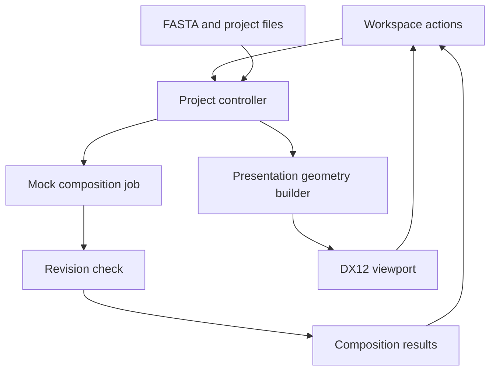

# Implemented architecture — v0.1

The planned loop is implemented as a single local desktop application:



## Boundaries

- `Project`: authoritative baseline, current sequence, revision and transient undo/redo/result state. Parsing validates before mutation. Every scenario change increments the revision and invalidates its result. `accept()` rejects an obsolete result.
- `Geometry`: builds a bounded schematic mesh from sequence state. It derives complements and highlights selected/changed base pairs; it does not change scientific data.
- `Dx12Renderer`: owns Windows graphics resources. It consumes meshes and camera settings, compiles embedded lighting shaders, presents frames, and projects picking targets. It does not edit a project.
- `Application`: routes native UI commands into Project; schedules an explicitly artificial 1.2-second mock-job completion with a timer; updates presentation and exports. New mutations cancel the pending mock job. No background scientific compute is claimed.

## Rendering

DXGI swap chain with two buffers, D3D12 depth buffer, vertex-color diffuse/specular/rim lighting, upload-heap geometry, root constants for view/projection and light intensity. Each frame waits for its GPU fence before reuse; mesh replacement and resize also synchronize explicitly. This favors correctness and simplicity over throughput for a small v0.1 scene. Feature-level 11_0 DX12 hardware is attempted; WARP is the fallback.

Geometry has two strands, paired colored cylinders, spherical endpoints, backbone connections and an optional floor grid. Comparison draws a dim baseline beside the scenario. Picking approximates endpoint selection in screen space with a 24-pixel radius; it is not triangle-accurate ray tracing and may select an overlapping endpoint.

The renderer smoke test uses the same device, shader, scene and camera path as the application. It resizes the swap chain, reads back an actual GPU-rendered frame, checks for non-background pixels, finishes a mock analysis and round-trips a saved project. The BMP is test evidence, not a generated illustration.

## Data contract

Inputs: one plain A/C/G/T sequence or one FASTA record; whitespace and letter case are normalized. Ambiguous bases and multiple records are rejected, rather than silently removed. Limits: 4–256 bases and 64 KiB input files.

Project file format:

```text
EVOLVE_PROJECT 0.1
BASELINE_SEQUENCE
SCENARIO_SEQUENCE
```

Both sequences must have equal lengths. Save uses a temporary sibling file and Windows atomic replacement. The baseline is immutable within an editing session. Import or opening another project establishes a new baseline after an unsaved-change prompt. Save intentionally excludes view state, transient results and undo/redo history.

Result contract: run revision, baseline GC percentage, scenario GC percentage, edited-base count and `mock-composition-v0.1` provenance. These are composition statistics, not biological-effect predictions.

## Deliberate reductions from the design draft

The full plan allowed an Unreal presentation client, Python scientific host, persistent job store, model registry, scientific provenance, and voice/assistant features. v0.1 implements the requested basic desktop interaction slice in native C++/DX12. None of those deferred systems are represented as working integrations. It has no runtime third-party package dependencies, model credentials or remote services.

## Next extension points

1. Replace `Project::analyze()` behind an analysis interface with one scientifically supported adapter; extend inputs with biological context and reference identifiers.
2. Move expensive analysis into a worker/service while retaining revision-keyed results and cancellation. Avoid doing it on the UI thread.
3. Add explicit evidence and units to results and mappings from scientific IDs to visual entities.
4. Evolve the project format through explicit version migrations; persist scenarios, run provenance and settings.
5. Introduce instancing and frame resources before increasing data sizes.
6. A future Unreal client should consume the project/presentation contracts; the core has no Windows dependencies.

DX12 implementation references: [Microsoft's basic component guide](https://learn.microsoft.com/en-us/windows/win32/direct3d12/creating-a-basic-direct3d-12-component) and [swap-chain guidance](https://learn.microsoft.com/en-us/windows/win32/direct3d12/swap-chains).
