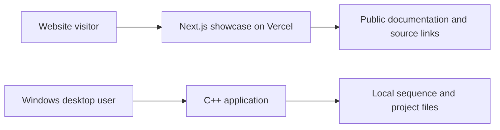

# Project architecture

Evolve uses one repository with two independently built applications.

The website presents the project and links to public source and research scope. It does not submit simulation jobs or load private Drive materials. The C++ application remains local and has no network service.

- `apps/website`: Next.js, npm, independent lockfile, Vercel deployment.
- `apps/simulation`: CMake, portable core tests, Windows desktop build and WARP smoke test.
- `docs`: public concept, requirements, research scope, roadmap, and cross-project decisions.
- `.github/workflows`: independent application checks and desktop release packaging.

See the [desktop architecture](../../apps/simulation/docs/ARCHITECTURE.md) for implementation details. A future browser workspace would require a separately designed scientific compute boundary; this migration introduces no API or file-format changes.
